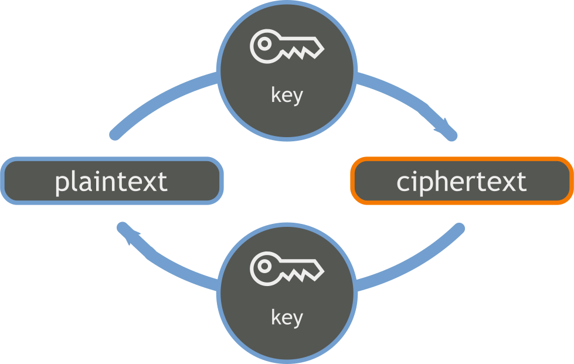
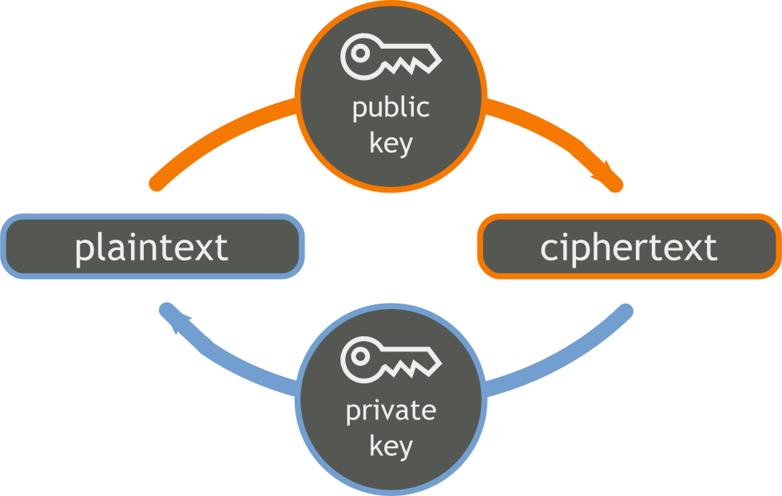
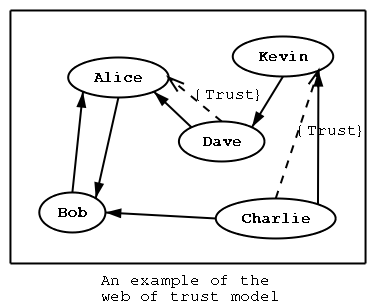

#GNU PRIVACY GUARD

Marta Feriani

`marta.celeste.feriani@gmail.com`

Corsi GNU/Linux Avanzati 2016

---

#COSA FACCIAMO OGGI

--

* introduzione alla cifratura:
	* simmetrica
	* asimmetrica
* Web of Trust
* GPG the hard way
* daily GPG

---

##PERCHÈ CIFRARE?

* tenere al sicuro dati sensibili
	* miei
	* degli altri (aziendali etc.)
* privacy nelle conversazioni

--

* implementazione di _OpenPGP_
	* __P__retty __G__ood __P__rivacy

* cosa fa? tante cose

---

##LA STORIA DI ALICE & BOB

Alice e Bob vogliono scambiarsi messaggi

senza che nessun altro (all'infuori di loro)

possa leggerli

--

##CIFRATURA

--

##1° TENTATIVO PER ALICE & BOB
###CIFRATURA SIMMETRICA

* A sceglie una chiave ___k___
* A cifra il messaggio ___m___ per B con ___k___
* A invia ___m___ a B
* B riceve ___m___ cifrato
* B decifra ___m___ con ___k___
* B legge ___m___

--

--

###PROBLEMI CIFRATURA SIMMETRICA

* Sia Alice che Bob devono conoscere ___k___ a priori
	* ___k___ va scambiata di persona
* __k__ ha duplice funzione: cifra/decifra
	* per sua natura __non deve essere divulgata__

--

##ALICE & BOB CI RIPROVANO
###CIFRATURA ASIMMETRICA

* ogni utente (Alice e Bob) dispone di due chiavi
	* chiave pubblica: cifra
	* chiave privata: decifra

_Le due chiavi sono indipendenti tra loro,_ 

_dall'una non è possibile ricavare l'altra_

--

--

##ALICE & BOB... 
###LO SCAMBIO DELLE CHIAVI

* A e B si scambiano le rispettive chiavi pubbliche

_ognuno custodisce (gelosamente) la propria chiave privata_

--

###MESSAGGIO SOLO PER BOB

* Alice cifra ___m___ con chiave pubblica di Bob $k_{B,pub}$

_Solo Bob con la sua privata_ $k_{B,pri}$

_può decifrare il messaggio_ 

* A invia ___m___ cifrato a B
* B riceve ___m___
* B decifra ___m___ con $k_{B,pri}$
* B legge

--

###THERE'S STILL WORK TO DO

Quando Bob riceve ___m___ ha la _certezza_ che il messaggio sia per lui.

Non ha invece garanzie _su chi_ abbia mandato effettivamente ___m___

($k_{B,pub}$ è disponibile per tutti coloro vogliano contattare Bob)

--

###MESSAGGIO SOLO DA ALICE

Oltre a cifrare , Alice _firma_ ___m___ con $k_{A,priv}$

* Bob riceve ___m___
* B "decifra" la firma di A con $k_{A,pub}$

_Certezza che __m__ sia scritto da A_

--

###CIFRATURE A CONFRONTO
_Simmetrica:_

* leggera
* veloce
* _scambio delle chiavi di persona_
* _tante chiavi da memorizzare_

_Asimmetrica:_

* lenta
* 2 chiavi per 2 diversi scopi
* scambio comodo
* _facile fingersi qualcun altro_

---

##WEB OF TRUST

--

###TRUST MODEL

gli utenti si comportano da _notai_

certificano il legame _utente, chiave_

--

###HOW TO

* ciascuno si autocertifica

	$SIG_{priv,A}(Pub_A, ID_A)$
* si possono avere altre certificazioni, da altri utenti

	$SIG_{priv,B}(Pub_A, ID_A)$

--

###GESTIONE CHIAVI

* distribuzione: servers
* gestione locale: keyrings, trust_db

--

###LIVELLO PUBBLICO: SERVERS

* chiavi memorizzate su servers
* servers connessi tra loro (protocollo di sincronizzazione)
  interazione con client via HTTP[S]  (HKP[S])
* sincronizzazione e propagazione delle chiavi

--

###LIVELLO LOCALE: KEYRINGS

* archivi di chiavi locali:
	* chiavi pubbliche (mie, di altri)
	* chiavi private

_Pub_ring_ | | _Sec_ring_ 
--- | --- | ---
$Pub\_A$, $ID\_A$, $SIG\_{ME}$ | | $Pri\_{ME}$
$Pub\_{ME}$, $ID\_{ME}$| | ...

--

###LIVELLO LOCALE: TRUST_DB (1)

associa ad ogni chiave di _Pub_ring_ un livello di fiducia

_Keys_ | | _Levels_ 
--- | --- | ---
$Pub_{someone}$ | | $trust level$
$Pub_{someoneelse}$ | | ...
...| | ...

i valori vengono settati dall'utente, a mano 

--

###LIVELLO LOCALE: TRUST_DB (2)

1. unknown
2. undefined
3. untrusted
4. marginal
5. full
6. ultimate

--

###LIVELLO LOCALE: VALIDITY (1)

quanto il possessore del _keyring_ possa ritenere valida la chiave

1. unknown
2. untrusted
3. marginal
4. full

--

###LIVELLO LOCALE: VALIDITY (2)

###RULES

_Sig Trust Level_| | _Key Validity_
--- | --- | ---
ultimate | | full
full | | full
marginal | | marginal
3x marginal | | full
untrusted | | ...

--

##FORMATO CHIAVI (1)

* generazione chiavi: due coppie
	* Primary (pub & priv)
	* Subkey (pub & priv)

--

##FORMATO CHIAVI (2)

_Convenzione_

* $SIG\_{M^A_{Priv}}(m)$ → A firma m

* $AUTH\_{M^A_{Pub}}(m)$ → B verifica firma di A

* $ENC\_{S^A_{Pub}}(m)$ → B cifra per A

* $DEC\_{S^A_{Priv}}(c)$ → A decifra c

--

##CERTIFICATE FORM (RFC 4880)

|$Master\_{Pub}^A$|
|--- |
|$ID\_A$ | 
|$SIG\_{M\_{Priv}^A}(M\_{Pub}^A, ID\_A)$ |
|$Sub\_{Pub}^A$S |
|$SIG\_{M\_{Priv}^A}(M\_{Pub}^A, S\_{Pub}^A)$ |
|$SIG\_{S\_{Priv}^A}(M\_{Pub}^A, S\_{Pub}^A)$ |

--

##FIRME DIVERSE

_certificazione identità_

* autocertificazione $SIG\_{M\_{Priv}^A}(M\_{Pub}^A, ID\_A)$
* da altri utenti $SIG\_{M\_{Priv}^B}(M\_{Pub}^A, ID\_A)$

--

##FIRME DIVERSE

_legame con sottochiavi_

* $SIG\_{M\_{Priv}^A}(M\_{Pub}^A, S\_{Pub}^A)$
* $SIG\_{S\_{Priv}^A}(M\_{Pub}^A, S\_{Pub}^A)$

--

##MODIFICA CERTIFICATO

* scarico dal server
* appendo in coda la modifica
* rimetto sul server

__NB: i server non controllano l'integrità dei certificati__

--

##IN CASO DI CATASTROFI
###REVOCATION SIGNATURE

certificati differenti per:

* revoca chiave primaria
* revoca sottochiave
* revoca firma

--

##STATO DELLA WEB OF TRUST

rappresentata come un grafo (orientato)

--

##ALCUNI DATI

* 3'867'397 chiavi totali

--

--

* 300k nodi isolati
* ~117 chiavi di media per SCC
* STRONGSET: 59'466 chiavi

---

#LET'S DO STUFF

--

##installazione

	$ sudo apt-get install gnupg2

--

##GENERAZIONE CHIAVI
	
	$ gpg2 --full-gen-key

--

##DEMO

--

##MANUTENZIONE CHIAVI (1)

_operazioni da e verso keyservers_

	$ gpg2 --send-key <ID> # esporto chiavi
	$ gpg2 --search-keys <nome> # cerco chiavi
	$ gpg2 --recv-keys <ID> # importo chiavi
	$ gpg2 --import <file> # importo da file locale
	$ gpg2 --refresh-keys # controllo cambiamenti

--

##DEMO

--

##MANUTENZIONE CHIAVI (2)

	$ gpg2 --armor --export <nome> # esporto chiavi
	$ gpg2 --gen-revoke <nome> # certificato di revoca

--

##DEMO

---

##CIFRIAMO COSE! (1)

_simmetrica_

	$ gpg2 --symmetric <nomefile>
	$ gpg2 --decrypt <nomefile>

--

##CIFRIAMO COSE! (2)

_asimmetrica_

	$ gpg2 --recipient "nome destinatario" --encrypt <nomefile>
	$ gpg2 --output <outputfile> --decrypt <nomefile>

--

##FIRMIAMO COSE!

_firma_

	$ gpg2 --sign <doc>
	$ gpg2 --verify
	$ gpg2 --detach-sig <doc> # alternativo
	$ gpg2 --verify doc.sig <doc>
	$ gpg2 --clearsig <doc>

--

##DEMO

--

##GPG E PACCHETTI

* con GPG vengono firmati pacchetti  metadata dei repository
* il sistema controlla le firme sui repo in automatico
* si può verificare (a mano) la firma sul singolo .deb

--

##GPG E PACCHETTI

	$ gpg2 --verify nomesorgente.dsc # verifica il source
	$ debsig-verify nomepck.deb # verifica il pacchetto

--

##GPG & POSTA
###FORMATO E-MAIL

* header

	To: dest@mail.cose
	From: mitt@mail.cose
	Subject: gatti

* body: body della mail (ASCII)

--

##E-MAIL THE HARD WAY

--

##E-MAIL THE EASY WAY

* Thunderbird + Enigmail
* K_9 + OpenKeyChain
* GPG Tools + Apple Mail
* iPGMail
* Outlook + GpgOL

--

#THAT'S ALL FOLKS!

 

###### Quest'opera è distribuita con Licenza <a rel="license" href="http://creativecommons.org/licenses/by-nc-sa/4.0/">Creative Commons Attribuzione - Non commerciale - Condividi allo stesso modo 4.0 Internazionale</a>.

