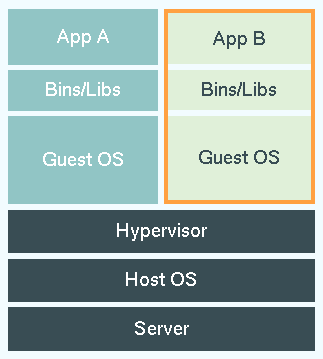
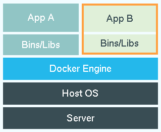
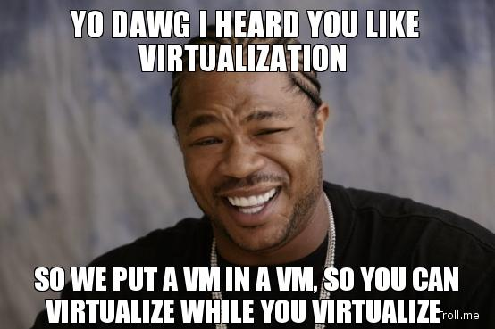

# Virtualization
Find Me on Twitter: @nJoyneer

And on Github: @thypon

Or By Mail: miwaxe@gmail.com

---

### Let Me  It For You

Virtualization refers to creating a virtual version of something:

- **Virtual Computer Hardware** (emulators)
- **Operating System** (full linux, windows, *bsd)
- **Storage Device** (FileSystem, Block Device)
- **Computer Network** (Lan Deploy)

--

### Today Lesson

- **Virtual Computer Hardware** (emulators)
- **Operating System** (full linux, windows, *bsd)
- **Storage Device** (FileSystem, Block Device)
- **Computer Network** (Lan Deploy)

--

--

### Today Lesson

- ~~**Virtual Computer Hardware** (emulators)~~
- **Operating System** (full linux, windows, *bsd)
- ~~**Storage Device** (FileSystem, Block Device)~~
- ~~**Computer Network** (Lan Deploy)~~

---

## Virtualization Levels

Could be:

- Full Virtualization
- OS Level Virtualization

--

## Virtualization Levels

And orthogonally:

- Shared Nothing/Something
- Passthrough

---

### Full Virtualization

<!--### $\text{Cogito}^2$ Ergo $\text{Sum} \times 2$-->
## Cogito Ergo Sum

--

### Full Virtualization

Could be:

- Software baked
- Hardware based

And all the intermediate stages.

--

### Architecture

--

### Approach

It's a **bottom-up** approach:

- recreates virtual devices on top of real ones.
- shared nothing (usually):

	* memory sectionated/assigned to different devices
	* input/output devices emulated in software
	* cpus time shared between virtual machines

---

## Current Solutions

--

### Vagrant

--

### Vagrant
#### One Ring to rule them all, One Ring to find them,
#### One Ring to bring them all and in the darkness bind them

- Easy to configure
- Reproducible
- Portable work environment
- Based on pluggable hypervisors. Runs on:
	- Virtualbox
	- VMWare
	- HyperV
	- Parallels

--

### Install Vagrant

On recent debian/ubuntu is simple as:

	apt-get install vagrant

To install on other operative systems install:

- Virtualbox
- Vagrant through https://www.vagrantup.com/downloads.html

--

### Run Vagrant

Initialize Vagrant virtual machine

	host> mkdir testvm/
	host> cd testvm/
	host> vagrant init hashicorp/precise32

Downloads and sets up the virtual machine

	host> vagrant up

--

### Connect to Vagrant VM

	host> vagrant ssh
	guest> # do the command you want

--

### Vagrant Boxes

	vagrant box add hashicorp/precise32

This will **download** and **memoize** the box named "hashicorp/precise32" from HashiCorp's Atlas box catalog, **a place where you can find and host boxes**.

	Vagrant.configure("2") do |config|
		...
		config.vm.box = "hashicorp/precise32"
		...
	end

--

### Find (other) Boxes

It's possibile to find new boxes in https://atlas.hashicorp.com/boxes/search

--

### Forward Network ports

	Vagrant.configure("2") do |config|
		...
		config.vm.network :forwarded_port, host: 4567, guest: 80
		...
	end

--

On **top of a virtual machine** we mount an **unmodified** operative system.

However it's an **heavyweight approach**. You run full operative system with sliced resources/interrupts on top of the same hardware.

--

### Vagrant Extras

- Can provide **multi-tier** vm architecture
- Can **run scripts** during the **first boot** to create custom installations

---

#### OS Level Virtualization or

### Glorified Chroots

The **kernel** allows:

- multiple userspaces*
- isolated userspaces*

*You control _how much_

--

---

## Docker

--

### What is Docker?

Is a platform to _ applications:

- build
- ship
- run

And consists of:

- Docker Runtime
- Packaging Tool
- Docker Hub

--

### Why Docker?

Developers can:

- build apps in any language using any toolchain
- run on any platform (non Linux OS through Vagrant)
- manage app dependencies automatically
- use alredy packaged apps (16000+)

--

### Why Docker?

Sysadmins can:

- abstract OS differences
- scale up/down easily

Common user can:

- Achieve Native speed
- Get minimum security w/o problems
- Achieve transactional updates without downtime

--

### Why not Docker?

You:

- want security first (VMs are better)
- you run a multi-seat server

--

### Docker versus VM

| Docker  | Virtual Machine |
|--|--|
|   |  |

--

### Docker versus VM

Docker only `virtualize` the os abi level:
In docker the application contains not only the **app** code but also the **libraries and binaries** that usually weight Megabytes.

**VM** instead contains also the **entire operative system** needed that usually weghts Gigabytes.

Besides that there is also the **vm initialization/interrupts/kernel overhead**.

--

### Initialize Docker (Quick and dirty)

	> docker run -i -t ubuntu /bin/bash
	Unable to find image 'ubuntu:latest' locally
	Pulling repository ubuntu
	d0955f21bf24: Download complete
	511136ea3c5a: Download complete
	f3c84ac3a053: Download complete
	a1a958a24818: Download complete
	9fec74352904: Download complete
	Status: Downloaded newer image for ubuntu:latest

--

### Run your language runtime

	> docker run -i -t ruby /usr/local/bin/irb
	irb(main):001:0>

	> docker run -i -t python /usr/local/bin/python
	Python 3.4.3 (default, Mar 20 2015, 22:04:56)
	[GCC 4.9.2] on linux
	Type "help", "copyright", "credits" or "license" for more information.
	>>>

--

### Search for new containers

	> docker search nginx
	... results here

	> docker search mysql
	... results here

--

### Pull images

	> docker pull ruby:version

--

### Compose N-tier Architecture

`docker-compose` (formerly `fig`) is an external tool that permits to orchestrate multi-tier independent system.

--

### Compose N-tier Architecture (Example)

Configuration Example:

	web:
  	build: .
	  links:
	   - db
	  ports:
	   - "8000:8000"
	db:
	  image: postgres

---

# Practical Session

---

# Disclaimer

--

This talk was ~~stupid~~ interesting even ~~without~~ with the presence of memes.

~~Don't~~ try this at home.

--

---

# Thanks for all the fish

Find Me on Twitter: @nJoyneer

And on Github: @thypon

Or By Mail: miwaxe@gmail.com
